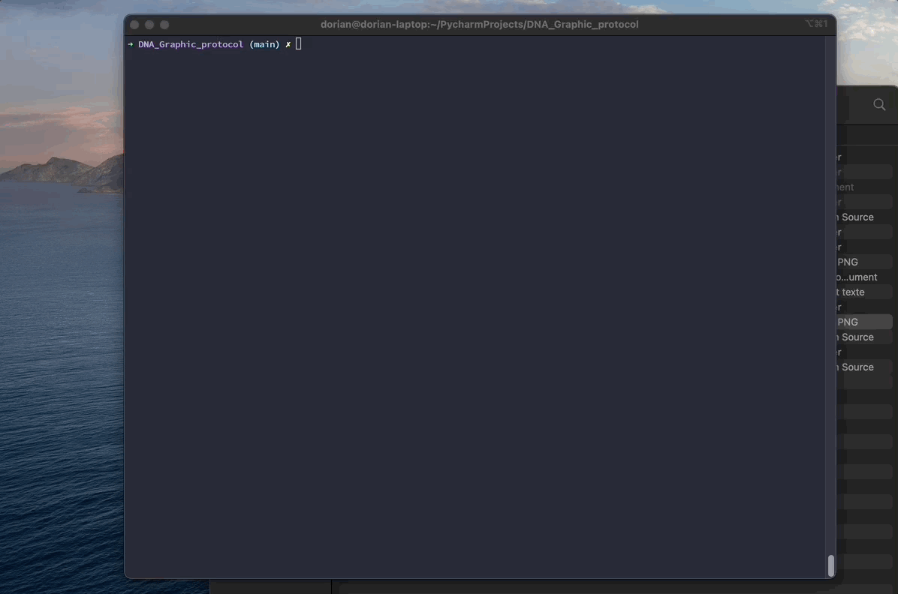

# Graphical Protocol inspired of DNA

## Representation

We need 4 uniques proteins :

| Nucleotides Name | Nucleotides |   Base   | Color  |
|:----------------:|:-----------:|:--------:|:------:|
|     Adenine      |      A      |    0     |  red   |
|     Thymine      |      T      |    1     | green  |
|     Guanine      |      G      |    2     |  blue  |
|     Cytosine     |      C      |    3     | yellow |


StartCell value encoded :

- redundant = 200
- normal = 151

EndCell value encoded = 140

## How to use it

Please install requirements before.

```
pip install -r requirements.txt 
```

or

```
pip install pygame rich  
```

Non redundant :

```
python3 bootstrap.py -m "de" -o "de.jpg"
```

Redundant :

```
python3 bootstrap.py -r -m "de" -o "de.jpg"
```

Help :

```
python3 bootstrap.py -help
```

## Example


