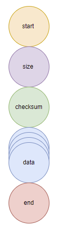

# Graphical Protocol inspired of DNA

## Representation

We need 4 uniques proteins :

| Nucleotides Name | Nucleotides |   Base   | Color  |
|:----------------:|:-----------:|:--------:|:------:|
|     Adenine      |      A      |    0     |  red   |
|     Thymine      |      T      |    1     | orange |
|     Guanine      |      G      |    2     | yellow |
|     Cytosine     |      C      |    3     | green  |

